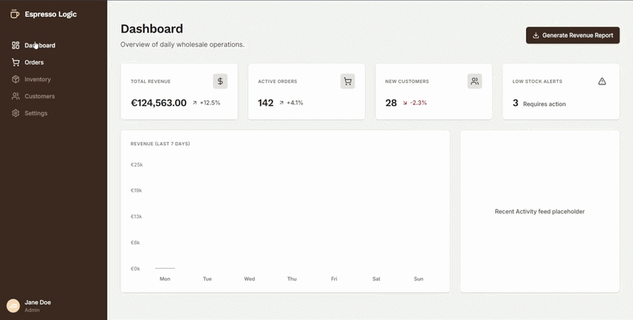

# Enterprise Coffee Wholesale Order Dashboard

[](https://enterprise-order-management.vercel.app/)


<p align="center">
  
</p>

## Overview

The **Enterprise Coffee Wholesale Order Dashboard** is a high-performance, responsive B2B management platform tailored for coffee roasteries. Built to handle complex data interactions, live order tracking, and inventory management, this dashboard serves as a highly polished, production-ready interface that balances dense data presentation with an elegant, modern user experience.

The application follows an "Espresso Logic" design system—featuring deep espresso browns (`#3D2B1F`) and warm grays—providing a premium, professional aesthetic while strictly adhering to WCAG accessibility and contrast standards.

## Tech Stack

This project is built utilizing a modern, enterprise-grade React ecosystem:

- **Framework**: [Next.js 15 (App Router)](https://nextjs.org/)
- **Language**: [TypeScript](https://www.typescriptlang.org/)
- **Styling**: [Tailwind CSS v4](https://tailwindcss.com/)
- **Data Tables**: [TanStack Table v8](https://tanstack.com/table/latest)
- **State Management**: [Zustand](https://docs.pmnd.rs/zustand/getting-started/introduction)
- **Animations**: [Framer Motion](https://www.framer.com/motion/)
- **Testing**: [Vitest](https://vitest.dev/) & [React Testing Library](https://testing-library.com/)
- **Icons**: [Lucide React](https://lucide.dev/)

## Key Features

- **Advanced Data Grid**: Features a highly interactive `TanStack Table` implementation supporting global fuzzy search, column-specific status filtering, multi-directional column sorting, and row selection.
- **Micro-Interactions & Animations**: Integrated `Framer Motion` to power a slide-out Order Details Drawer, dynamic Revenue Bar Charts, and a floating Bulk Action Bar that gracefully animates in/out of the viewport based on user selection state.
- **Global Toast Notification System**: A completely deterministic, Zustand-powered global notification system that safely manages asynchronous success states and timeouts.
- **Deterministic UI Recovery**: Includes a robust `mockApi.ts` utility designed to test global React Error Boundaries and Loading Boundaries, ensuring the application fails gracefully during network latency or timeouts.
- **Accessible Design**: Strictly maintains high contrast ratios (e.g., deeply saturated amber text for warning states) and structural CSS Grid layouts to prevent cumulative layout shift (CLS).

## Testing & Coverage

The application logic has been rigorously tested using **Vitest** and **React Testing Library**. The test suite explicitly focuses on validating the global state container (Zustand) and complex DOM interactions within the data grid.

**Current Coverage Report:**

```text
 % Coverage report from v8
-------------------|---------|----------|---------|---------|
File               | % Stmts | % Branch | % Funcs | % Lines |
-------------------|---------|----------|---------|---------|
All files          |   96.36 |    81.57 |   94.11 |   95.74 |
 components/orders |   95.74 |    80.55 |   92.59 |   95.12 |
  DataTable.tsx    |      92 |    68.75 |   85.71 |   89.47 |
  columns.tsx      |     100 |       90 |     100 |     100 |
 store             |     100 |      100 |     100 |     100 |
  useStore.ts      |     100 |      100 |     100 |     100 |
-------------------|---------|----------|---------|---------|
```

_Note: The core logical files (`useStore.ts` and `columns.tsx`) have achieved perfect 100% statement and functional coverage._

## Setup Instructions

### Prerequisites

- Node.js 18.17 or later

### Installation

1. Clone the repository and navigate into the project directory:

```bash
git clone <repository-url>
cd enterprise-order-management
```

2. Install dependencies:

```bash
npm install
```

3. Run the development server:

```bash
npm run dev
```

4. Open [http://localhost:3000](http://localhost:3000) with your browser to explore the dashboard.

### Testing Commands

- Run all unit tests:

```bash
npm run test
```

- Run tests and generate coverage report:

```bash
npm run test:coverage
```

## License

This project is licensed under the MIT License.
